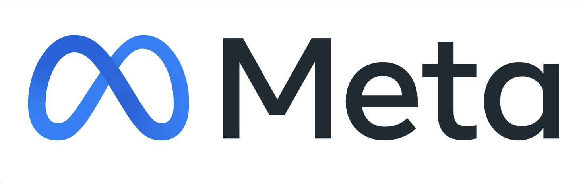

  <h3 style="color: #4caf50; margin-top: 0; font-size: 2em;">Announcement:</h3>
  

    Learn more and sign up for the AgentX - AgentBeats Competition <a href="https://rdi.berkeley.edu/agentx-agentbeats" style="color: #4caf50; font-weight: bold;">here</a>.
  

## Prospective Students

- **Students interested in the course should first try enrolling in the course in CalCentral. Please join the waitlist if the class is full. The class number is 15131 for CS194-196 and 32761 for CS294-196.**
- **We plan to expand the class size to allow more students to join. Please fill in the <a href="https://forms.gle/MSLYVZJmaDaaE2B48">petition form</a> if you are on the waitlist or can't get added to the waitlist. We expect to have accepted students enrolled 1-2 weeks into the Fall semester.**
- ***Do not email course staff or TAs. Please use [Edstem](https://edstem.org/us/join/MWjY99) for any questions. For private matters, post a private question on Edstem and make sure it is visable to all teaching staff.***

## Course Staff

<table class="instructors">
  <tbody>
    <tr>
      <td>Instructor</td>
    </tr>
    <tr>
      <td></td>
    </tr>
    <tr>
      <td><a href="https://people.eecs.berkeley.edu/~dawnsong/">Dawn Song</a></td>
    </tr>
    <tr>
      <td>Professor, UC Berkeley</td>
    </tr>
  </tbody>
</table>

<h3 class="teaching-staff">
  Teaching Staff: Xiuyu Li, Baifeng Shi, Chenyang Wang, Arhaan Aggarwal
</h3>

## Guest Speakers

<table class="speakers">
  <tr>
    <td>
      

        
        
Yann Dubois

        
Member of Technical Staff

        

      

    </td>
    <td>
      

        
        
Yangqing Jia

        
VP, Al System Software

        

      

    </td>
    <td>
      

        
        
Jiantao Jiao

        
Director of Research & Distinguished Scientist

        

      

    </td>
  </tr>

  <tr>
    <td>
      

        
        
Weizhu Chen

        
Technical Fellow & CVP

        

      

    </td>
    <td>
      

        
        
Noam Brown

        
 Research Scientist

        

      

    </td>
    <td>
      

        
        
Sida Wang

        
Research Scientist

        

      

    </td>
  </tr>

  <tr>
    <td>
      

        
        
James Zou

        
Professor

        

      

    </td>
    <td>
      

        
        
Clay Bavor

        
Co-Founder

        

      

    </td>
    <td>
      

        
        
Oriol Vinyals

        
VP, Research

        

      

    </td>
  </tr>

  <tr>
    <td>
      

        
        
Peter Stone

        
Chief Scientist at Sony Al, Professor at UT Austin

        

      

    </td>
    <td></td>
    <td></td>
  </tr>
</table>

## Class Time and Location

Lecture: 3-5pm PT Monday at Valley Life Sciences 2050 

## Course Description

Agentic AI is the new frontier and poised to transform the future of our daily life with the support of intelligent task automation and personalization. In this course, we will first discuss fundamental concepts that are essential for Agentic AI, including the foundation of LLMs, reasonsing, planning, agentic frameworks and infrastructure. We will also cover representative agent applications, including code generation, robotics, web automation, and scientific discovery. Meanwhile, we will discuss limitations and potential risks of current LLM agents, and share insights into directions for further improvement.

## Syllabus

<table style="width: 100%; table-layout: fixed;">
<thead>
<tr>
<th style="width: 15%;">Date</th>
<th style="width: 35%;">Lecture   (3:10PM-5:00PM PT)</th>
<th style="width: 50%;">Supplemental Readings</th>
</tr>
</thead>
<tbody>
<tr>
<td>Sep 8</td>
<td><strong>Introduction</strong>   Dawn Song, UC Berkeley   [<a href="{{ site.baseurl }}/slides/introduction_25.pdf">Slides</a>]</td>
<td></td>
</tr>
<tr>
<td>Sep 15</td>
<td><strong>LLM Agents Overview</strong>   Yann Dubois, OpenAI   [<a href="{{ site.baseurl }}/slides/lecture1.pdf">Slides</a>] [<a href="https://www.youtube.com/watch?v=r1qZpYAmqmg">Recording</a>]</td>
<td>- <a href="{{ site.baseurl }}/slides/d11.pdf">KIMI K2: Open Agentic Intelligence</a>   - <a href="{{ site.baseurl }}/slides/d22.pdf">DeepSeek-V3 Technical Report</a></td>
</tr>
<tr>
<td>Sep 22</td>
<td><strong>Evolution of system designs from an AI engineer perspective</strong>   Yangqing Jia, NVIDIA   [<a href="{{ site.baseurl }}/slides/Yangqing.pdf">Slides</a>] [<a href="https://www.youtube.com/watch?v=xqRAS6rAouo&list=PLS01nW3RtgoqGkm4UeqNeZLccW-OGc1fJ&index=2">Recording</a>]</td>
<td></td>
</tr>
<tr>
<td>Sep 29</td>
<td><strong>Post-Training Verifiable Agents</strong>   Jiantao Jiao, NVIDIA   [<a href="{{ site.baseurl }}/slides/AgenticAI_Jiantao Jiao.pdf">Slides</a>] [<a href="https://www.youtube.com/watch?v=3l0Zxus34es&list=PLS01nW3RtgoqGkm4UeqNeZLccW-OGc1fJ&index=3">Recording</a>]</td>
<td>- <a href="https://openai.com/index/introducing-swe-bench-verified/">Introducing SWE-bench Verified</a>   - <a href="https://openai.com/index/browsecomp/">BrowseComp: a benchmark for browsing agents</a></td>
</tr>
<tr>
<td>Oct 6</td>
<td><strong>Agent Evaluation & Project Overview</strong>   [<a href="{{ site.baseurl }}/slides/LLM Agent Evaluations & Project Overview.pdf">Slides</a>] [<a href="https://www.youtube.com/watch?v=VfOA2a0dj4w">Recording</a>]</td>
<td>- <a href="https://arxiv.org/pdf/2503.16416">Survey on Evaluation of LLM-based Agents</a></td>
</tr>
<tr>
<td>Oct 13</td>
<td><strong>Some Challenges and Lessons from Training Agentic Models</strong>   Weizhu Chen, Microsoft   [<a href="{{ site.baseurl }}/slides/weizhu.pdf">Slides</a>] [<a href="https://www.youtube.com/watch?v=xNxrBHZPDvM">Recording</a>]</td>
<td></td>
</tr>
<tr>
<td>Oct 20</td>
<td><strong>Multi-Agent AI</strong>   Noam Brown, OpenAI   [<a href="{{ site.baseurl }}/slides/multiagent_berkeley_2025.pptx.pdf">Slides</a>] [<a href="https://www.youtube.com/watch?v=SrLcGdVOb9w">Recording</a>]</td>
<td></td>
</tr>
<tr>
<td>Oct 27</td>
<td><strong>Predictable Noise in LLM</strong>   Sida Wang, Meta   [<a href="{{ site.baseurl }}/slides/PredEval.pdf">Slides</a>] [<a href="https://www.youtube.com/watch?v=HV8pugcFVO0">Recording</a>]</td>
<td>- <a href="https://arxiv.org/pdf/2411.00640">Adding Error Bars to Evals: A Statistical Approach to Language Model Evaluations</a></td>
</tr>
<tr>
<td>Nov 3</td>
<td><strong>AI Agents to Automate Scientific Discoveries</strong>   James Zou, Stanford   [<a href="https://www.youtube.com/watch?v=yqPIsTTdUkc">Recording</a>]</td>
<td>- <a href="https://www.nature.com/articles/s41586-025-09442-9">The Virtual Lab of AI agents designs new SARS-CoV-2 nanobodies</a>   - <a href="https://arxiv.org/abs/2509.06917">Paper2Agent: Reimagining Research Papers As Interactive and Reliable AI Agents</a></td>
</tr>
<tr>
<td>Nov 10</td>
<td><strong>Practical Lessons from Deploying Real-World AI Agents</strong>   Clay Bavor, Sierra   [<a href="{{ site.baseurl }}/slides/Practical_Lessons_AI_Agents.pdf">Slides</a>]</td>
<td>- <a href="https://arxiv.org/pdf/2506.07982">τ2-Bench: Evaluating Conversational Agents in a Dual-Control Environment</a>   - <a href="https://sierra.ai/blog/voice-sims-test-agents-in-real-world-conditions-before-they-talk-to-your-customers">Voice Sims: test agents in real world conditions before they talk to customers</a></td>
</tr>
<tr>
<td>Nov 17</td>
<td>Oriol Vinyals, Google DeepMind</td>
<td></td>
</tr>
<tr>
<td>Nov 24</td>
<td>Peter Stone, UT Austin / Sony AI</td>
<td></td>
</tr>
<tr>
<td>Dec 1</td>
<td><strong>Agentic AI Safety & Security</strong>   Dawn Song, UC Berkeley</td>
<td></td>
</tr>
<tr>
<td>Dec 8</td>
<td><strong>No lecture — RRR week</strong></td>
<td></td>
</tr>
</tbody>
</table>

## Enrollment and Grading

***Prerequisites:*** **Students are strongly encouraged to have had experience and basic understanding of Machine Learning and Deep Learning before taking this class, e.g., have taken courses such as CS182, CS188, and CS189.**

***Please fill out the <a href="https://forms.gle/MSLYVZJmaDaaE2B48">petition form</a> if you are on the waitlist or can't get added to the waitlist.***

This is a variable-unit course. Detailed grading breakdown will be released soon!

## Grading

<table class="grading-table">
  <thead>
    <tr>
      <th></th>
      <th>1 unit</th>
      <th>2 units</th>
      <th>3/4 units</th>
    </tr>
  </thead>
  <tbody>
    <tr>
      <td>Participation</td>
      <td>40%</td>
      <td>30%</td>
      <td>20%</td>
    </tr>
    <tr>
      <td>Quizzes</td>
      <td>20%</td>
      <td>10%</td>
      <td>10%</td>
    </tr>
    <tr>
      <td>Article</td>
      <td>40%</td>
      <td class="muted">—</td>
      <td class="muted">—</td>
    </tr>
    <!-- Project -->
    <tr class="group">
      <td>Project</td>
      <td class="muted">—</td>
      <td>Sum: 60%</td>
      <td>Sum: 70%</td>
    </tr>
    <!-- Phase 1 -->
    <tr class="section">
      <td>Phase 1</td>
      <td class="muted">—</td>
      <td>Sum: 45%</td>
      <td>Sum: 50%</td>
    </tr>
    <tr>
      <td class="sub">Proposal</td>
      <td class="muted">—</td>
      <td>5%</td>
      <td>5%</td>
    </tr>
    <tr>
      <td class="sub">Early demo (2-min video &amp; milestone report)</td>
      <td class="muted">—</td>
      <td>10%</td>
      <td>10%</td>
    </tr>
    <tr>
      <td class="sub">Final Green Agent Submission</td>
      <td class="muted">—</td>
      <td>30%</td>
      <td>35%</td>
    </tr>
    <!-- Phase 2 -->
    <tr class="section">
      <td>Phase 2</td>
      <td class="muted">—</td>
      <td>Sum: 15%</td>
      <td>Sum: 20%</td>
    </tr>
    <tr>
      <td class="sub">White agent implementation</td>
      <td class="muted">—</td>
      <td>10%</td>
      <td>15%</td>
    </tr>
    <tr>
      <td class="sub">White agent report (1–2 pages)</td>
      <td class="muted">—</td>
      <td>5%</td>
      <td>5%</td>
    </tr>
  </tbody>
</table>

Bonus will be awarded for participating in AgentX-AgentBeats Competition.

  <strong>Announcement for 1-Unit Students:</strong> You may choose to write an article or complete <em>Phase&nbsp;1</em> of the Agent Track. Either option is worth <strong>40%</strong> of your grade. If you choose the Agent Track, coding requirements are minimal—building a simple agent (e.g., via prompt engineering) is sufficient.

## Project Timeline

<table class="timeline-table">
  <thead>
    <tr>
      <th></th>
      <th>Released</th>
      <th>Due</th>
    </tr>
  </thead>
  <tbody>
    <tr>
      <td>Project group formation</td>
      <td>9/15</td>
      <td>9/22</td>
    </tr>
    <!-- NEW: Phase 1 row (row 3) -->
    <tr class="section">
      <td>Phase 1</td>
      <td></td>
      <td></td>
    </tr>
    <tr>
      <td>Green agent proposal</td>
      <td>9/27</td>
      <td>10/8</td>
    </tr>
    <tr>
      <td>Green agent demo submission &amp; short report</td>
      <td>10/7</td>
      <td>10/20</td>
    </tr>
    <tr>
      <td>Green agent submission &mdash; implementation, documentation &amp; recording</td>
      <td>11/7</td>
      <td>11/17</td>
    </tr>
    <!-- NEW: Phase 2 row (row 7) -->
    <tr class="section">
      <td>Phase 2</td>
      <td></td>
      <td></td>
    </tr>
    <tr>
      <td>White agent final submission &mdash; implementation &amp; report</td>
      <td>11/24</td>
      <td>12/12</td>
    </tr>
  </tbody>
</table>

## Article Timeline

Article (for 1-unit students) is due on 12/7.

## Office Hours

- Baifeng: Fridays, 5:30–6:30pm PT via Zoom(https://berkeley.zoom.us/j/5157669897)

- Xiuyu: Thursdays, 8–9am PT via Zoom (https://berkeley.zoom.us/j/93276025385)
