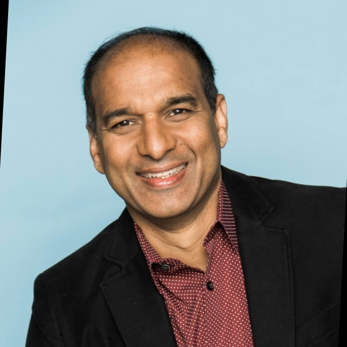

## Prospective Students

- **Students interested in the course should first try enrolling in the course in CalCentral. Please join the waitlist if the class is full. The class number is 15131 for CS194-196 and 32761 for CS294-196.**
- **We plan to expand the class size to allow more students to join. Please fill in the <a href="https://forms.gle/MSLYVZJmaDaaE2B48">petition form</a> if you are on the waitlist or can't get added to the waitlist. We expect to have accepted students enrolled 1-2 weeks into the Fall semester.**
- ***Do not email course staff or TAs. Please use [Edstem](https://edstem.org/us/join/MWjY99) for any questions. For private matters, post a private question on Edstem and make sure it is visable to all teaching staff.***

## Course Staff

<table>
<tbody>
<tr>
<td>Instructor</td>
<td>(Guest) Co-instructor</td>
</tr>
<tr>
<td></td>
<td></td>
</tr>
<tr>
<td><a href="https://people.eecs.berkeley.edu/~dawnsong/">Dawn Song</a></td>
<td>Xinyun Chen</td>
<tr>
<td>Professor, UC Berkeley</td>
<td>Research Scientist, Meta</td>
</tr>
</tr>
</tbody>
</table>

## Guest Speakers

<table class="table">
<tr>
<td></td>
<td></td>
<td></td>
<td></td>
</tr>

<tr>
<td>Yann Dubois</td>
<td>Yangqing Jia</td>
<td>Jiantao Jiao</td>
<td>Rao Surapaneni</td>
</tr>
 
<tr>
<td></td>
<td></td>
<td></td>
<td></td>
</tr>

<tr>
<td></td>
<td></td>
<td></td>
<td></td>
</tr>

<tr>
<td>Weizhu Chen</td>
<td>Noam Brown</td>
<td>Oriol Vinyals</td>
<td>Pushmeet Kohli</td>
</tr>
 
<tr>
<td></td>
<td></td>
<td></td>
<td></td>
</tr>

<tr>
<td></td>
</tr>

<tr>
<td>Peter Stone</td>
</tr>
 
<tr>
<td></td>
</tr>

</table>

## Class Time and Location

Lecture: 3-5pm PT Monday at Valley Life Sciences 2050 

## Course Description

Agentic AI is the new frontier and poised to transform the future of our daily life with the support of intelligent task automation and personalization. In this course, we will first discuss fundamental concepts that are essential for Agentic AI, including the foundation of LLMs, reasonsing, planning, agentic frameworks and infrastructure. We will also cover representative agent applications, including code generation, robotics, web automation, and scientific discovery. Meanwhile, we will discuss limitations and potential risks of current LLM agents, and share insights into directions for further improvement.

## Syllabus

Te be released soon!

## Enrollment and Grading

***Prerequisites:*** **Students are strongly encouraged to have had experience and basic understanding of Machine Learning and Deep Learning before taking this class, e.g., have taken courses such as CS182, CS188, and CS189.**

***Please fill out the <a href="https://forms.gle/MSLYVZJmaDaaE2B48">petition form</a> if you are on the waitlist or can't get added to the waitlist.***

This is a variable-unit course. Detailed grading breakdown will be released soon!

## Lab and Project Timeline

|                         | Released | Due    |
|-------------------------|----------|--------|
| Project group formation | 9/8      | 9/21    |
| Project proposal        |  9/21     | 10/5    |
| Lab                     |  9/15     |  10/12   |
| Project milestone       |  10/13     |  11/5   |
| Project final presentation    |  11/23     | 12/16    |
| Project final report    |  11/23     | 12/16    |